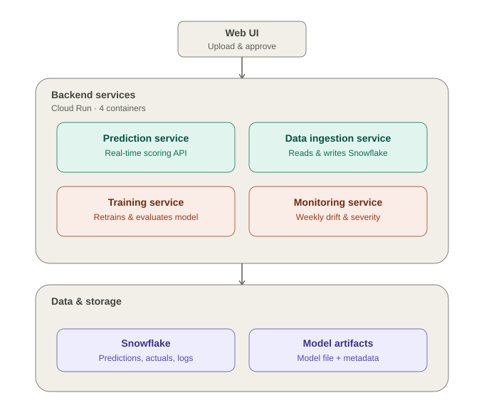
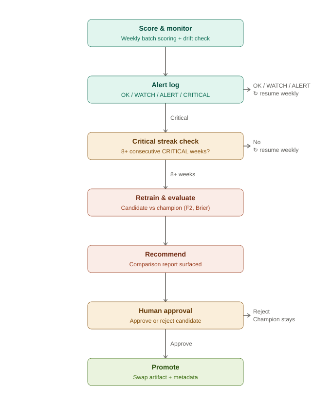

# Telecom Churn Prediction & Production Monitoring

An end-to-end churn prediction system built to mirror the responsibilities of an
AI Workflow / ML Operations Analyst role: rigorous model selection, a
microservices-based production deployment, a Snowflake-backed monitoring layer,
and a champion/challenger retraining workflow with human-gated promotion.

## Project motivation

This project rebuilds an earlier churn-prediction exercise (originally a bare
ANN with no evaluation) into a complete, production-minded system: disciplined
model selection, a containerized microservices architecture, a Snowflake data
warehouse for predictions/actuals/monitoring history, drift-aware monitoring,
and a governed model-retraining pipeline with a human approval gate before any
new model reaches production.

## System overview

The system is split into four independently deployable services, each
containerized separately and communicating over HTTP — no service shares a
filesystem or credentials with another beyond what it's explicitly given.

| Service | Responsibility | Port (local) |
|---|---|---|
| **prediction-service** | Loads the frozen model, serves real-time scoring (`/predict`), owns the model artifact and its reload | 8001 |
| **data-ingestion-service** | The only service with Snowflake credentials; owns all reads/writes to the warehouse, assigns week numbers server-side | 8002 |
| **training-service** | Retrains a challenger model, evaluates it against the current champion, and (on human approval) promotes it | 8003 |
| **monitoring-service** | Scores each incoming batch, computes drift scores and performance metrics, classifies severity, triggers retraining when warranted | 8004 |

A lightweight local UI (`ui/monitoring_control.html`) lets you upload a batch
and trigger a monitoring run without using `curl` directly.

## Architecture



## Monitor → alert → retrain workflow



## Pipeline overview

1. **Model selection** (`bootstrap/train_evaluate_select.py`)
   Compares Logistic Regression, Random Forest, and XGBoost via stratified
   5-fold cross-validation. Scaler choice is decided from empirical outlier
   analysis rather than default assumption. Classification threshold is
   tuned per model by maximizing F2 score (recall weighted above precision,
   reflecting the asymmetric cost of missing a churner). Evaluation includes
   calibration (Brier score, reliability curves), not just classification
   metrics. **Winner: Random Forest** — best F2 (~0.75 at threshold 0.25),
   best precision/recall together, lowest Brier loss (~0.054).

2. **Final training** (`bootstrap/train_final.py`)
   Stratified 60/40 split into a training pool and a production pool (class
   ratio preserved in both). Trains and freezes Random Forest on the
   training pool only. Persists the model, threshold, and feature schema as
   versioned artifacts. Each row carries a unique `record_id` (UUID),
   assigned before the split.

3. **Deployment & drift validation**
   A synthetic weekly deployment timeline and a validated, shift-invariant
   drift injection mechanism were used to confirm the monitoring system's
   sensitivity (catches a genuinely drifted feature) and specificity (stays
   quiet on unaffected features) before going live. Finding: feature
   importance did not reliably predict drift-impact severity — F2 and
   Brier disagreed on which feature caused the most damage across three
   isolated single-feature experiments.

4. **Production monitoring** (`monitoring-service`)
   Scores each incoming batch via `prediction-service`, computes
   feature-level drift scores against the training-time baseline, and —
   once ground truth resolves — computes coverage-aware performance metrics
   against a statistically-derived Brier baseline. Classifies each batch
   into a severity tier (`OK` / `[WARNING]` / `[ALERT]` / `[CRITICAL]`) and
   writes results to Snowflake via `data-ingestion-service`.

5. **Champion/challenger retraining** (`training-service`)
   Triggered only after 8 *consecutive* `[CRITICAL]` weeks under the current
   model version (not cumulative — a single clean week resets the streak).
   Retrains the same architecture on the expanding-window training set
   (recency-weighted so the drifted period isn't diluted by older history),
   re-derives its own threshold and baseline statistics, and evaluates
   against the current champion on the same recent, held-out weeks the
   candidate never trained on. Produces a recommendation (not a decision) —
   a human reviews champion-vs-challenger F2/precision/recall/Brier before
   approving or rejecting. Promotion atomically swaps the model artifact and
   its metadata together, and triggers a fresh monitoring run to validate
   the newly promoted model.

6. **Snowflake data warehouse**
   Four core tables: `PREDICTIONS` (one row per scoring event), `ACTUALS`
   (one row per resolved outcome, no feature data), `DRIFT_LOG` (one row per
   feature per week), `PERFORMANCE_LOG` (append-only, multiple rows per week
   as coverage improves), plus `FEATURE_SNAPSHOTS` (the point-in-time
   feature values behind each scoring event, joined with `ACTUALS` to form
   the expanding-window training set for retraining — a lightweight feature
   store). Reconciliation queries join predictions against resolved actuals
   to validate model behavior directly from the warehouse.

## Key findings

- Random Forest outperformed Logistic Regression and XGBoost on F2 score,
  precision, recall, and calibration (Brier loss) simultaneously.
- Feature importance does not reliably predict drift sensitivity: drifting
  the model's top-importance feature did not produce the largest performance
  degradation among the three features tested.
- A single drifted feature was detectable via distribution monitoring before
  any degradation in classification metrics was confirmable — validating a
  two-tier monitoring design where drift scores serve as an early warning
  and performance metrics serve as confirmation once ground truth arrives.
- Reconciling live predictions against actuals in Snowflake showed a 90.1%
  match rate overall, consistent with the model's known precision/recall on
  the minority (churn) class. Isolating "confidently wrong" predictions
  (probability < 0.15 but actually churned) found this error type spread
  across weeks 3-25 of the original simulation, not concentrated near any
  particular point — correctly ruling out drift as the cause and instead
  pointing to an inherent, roughly-constant rate of confident
  misclassification, consistent with the model's calibration curve.

## Repository structure

```
services/
  prediction_service/       real-time scoring, owns the model artifact
  data_ingestion_service/   sole owner of Snowflake credentials and schema
  training_service/         champion/challenger retraining and promotion
  monitoring_service/       weekly scoring, drift/severity classification
bootstrap/                  one-time, never-deployed scripts (model
                             selection, initial training/artifact creation)
ui/                         local HTML UI to trigger a monitoring run
docs/                       architecture and workflow diagrams
data/                       raw dataset and processed splits (bootstrap-only)
docker-compose.yml          local multi-container orchestration
README.md
RUNBOOK.md                  operational reference: severity levels, known
                             failure modes, environment setup, test plan
TEST_PLAN.md                structured test cases across every layer
```

Each `services/*` folder is fully self-contained (own `Dockerfile`, own
`requirements.txt`) — no service's Docker build reaches outside its own
folder.

## Tech stack

Python, pandas, scikit-learn, XGBoost, SQL, Snowflake (key-pair
authenticated), snowflake-connector-python, FastAPI, Docker, Docker Compose,
HTML/CSS/JavaScript (UI).

## Status and known limitations

Model selection, drift injection/validation, the four containerized
microservices, Snowflake schema, monitoring, and the champion/challenger
retrain-and-promote workflow (including human approval) are complete and
verified locally via Docker Compose.

**Not yet done:**
- **Cloud deployment.** The system currently runs locally via
  `docker-compose`; it has not yet been deployed to Cloud Run. Deploying
  `data-ingestion-service` requires resolving Snowflake's network-policy
  (static IP) requirement for the deployed environment.
- **External artifact storage.** `prediction-service` currently reads/writes
  its model artifact on local container disk. This does not survive a
  container restart or work across multiple instances — both realistic on
  Cloud Run. Before cloud deployment, this needs to move to an external
  store (Google Cloud Storage), with `prediction-service` downloading on
  startup/reload rather than reading a local file.
- **Automated alerting/dispatch.** Severity classification is complete and
  structured; there is no automated Slack/email dispatch on `[CRITICAL]` —
  a human currently has to check status directly. An n8n-based
  webhook/dispatch layer was designed but not built.
- **Automated data ingestion.** Batches are currently ingested via a manual
  UI upload, standing in for what a scheduled `data-gathering-service`
  would do automatically from real data sources. The ingestion API
  (`data-ingestion-service`) already assigns week numbers server-side and
  would need no changes to support that future service as an additional
  caller.

**Other known, deliberate gaps:** no persistent `customer_id` (the source
dataset has no real longitudinal customer identity, so `record_id`
identifies a scoring instance, not a person); `predictions` has no
`model_version` column (acceptable for reconciliation today, would need
revisiting to support comparing predictions across model versions);
week-number assignment assumes non-concurrent ingestion (a race is possible
under simultaneous uploads — low risk at current usage, worth a locking
mechanism before real concurrent traffic).

See `RUNBOOK.md` for operational details, severity thresholds, and the full
list of failure modes encountered during development.
